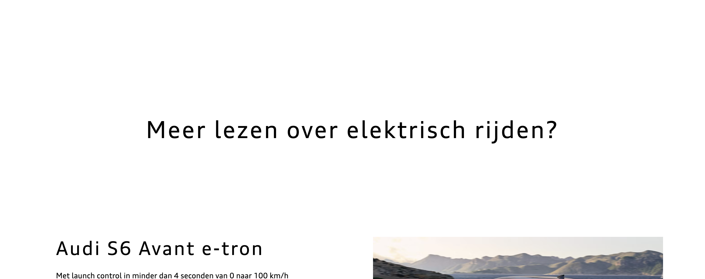
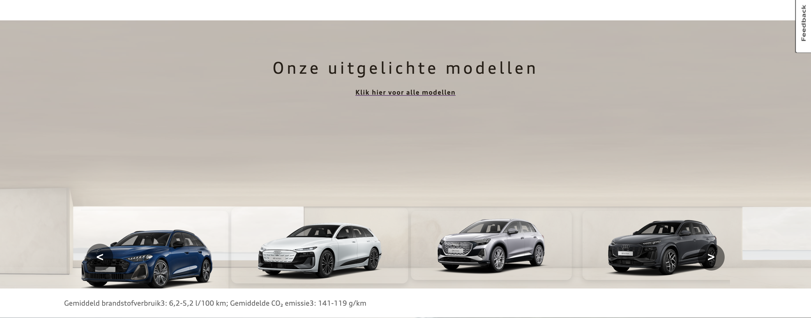

# Procesverslag
Markdown is een simpele manier om HTML te schrijven.  
Markdown cheat cheet: [Hulp bij het schrijven van Markdown](https://github.com/adam-p/markdown-here/wiki/Markdown-Cheatsheet).

Nb. De standaardstructuur en de spartaanse opmaak van de README.md zijn helemaal prima. Het gaat om de inhoud van je procesverslag. Besteedt de tijd voor pracht en praal aan je website.

Nb. Door *open* toe te voegen aan een *details* element kun je deze standaard open zetten. Fijn om dat steeds voor de relevante stuk(ken) te doen.

## Jij

  
uitwerken voor kick-off werkgroep

  ### Auteur:
  Thijs Krook

  #### Je startniveau:
  Rood

  #### Je focus:
  Surface plane
 

## Je website

  
uitwerken voor kick-off werkgroep

  ### Je opdracht:
 https://www.audi.nl/nl/

  #### Screenshot(s) van de eerste pagina (small screen): 
  Homepage
  

  #### Screenshot(s) van de tweede pagina (small screen):
  hier de naam van de pagina  
  
 

## Toegankelijkheidstest 1/2 (week 1)

  
uitwerken na test in 2e werkgroep

  ### Bevindingen
  Lijst met je bevindingen die in de test naar voren kwamen:

Smallscreen:
  - De h1 wordt afgekapt bij woorden, waardoor de leesbaarheid minder wordt.

  - De buttons worden aan de onderkant van de pagina geplaatst, waardoor er meer overzicht is voor de 

  - Er is een hamburgermenu aanwezig bij smallscreen.

  - Tekst heeft een goede lijnafstand van elkaar, waardoor de leesbaarheid beter wordt.

  - Er is een 'Terug naar boven' knop, waardoor de gebruiker automatisch weer naar de bovenkant van de pagina scrollt.

  Screenreader:

- Wanneer je op de zoekknop staat, wordt er gezegd dat de gebruiker zich op een knop, groep bevindt - wat voor verwarring kan zorgen bij de gebruiken.

- Als je op de 'volgende' knop klikt van de uitgelichte modellen - zegt de screenreader niet hoe het volgende model heet. Hij geeft alleen aan op welke links er geklikt kan worden, zoals 'configureren' en 'ontdekken'

- De screenreader geeft bij de afbeeldingen met tekst erin een duidelijke omschrijving van het onderwerp.

## Breakdownschets (week 1)

  
uitwerken na afloop 3e werkgroep

  ### de hele pagina: 
  

  ### dynamisch deel (bijv menu): 
  

  ### wellicht nog een dynamisch deel (bijv filter): 
  

## Voortgang 1 (week 2)

  
uitwerken voor 1e voortgang

  ### Stand van zaken
  hier dit ging goed & dit was lastig (neem ook screenshots op van delen van je website en code)

  ### Agenda voor meeting
  samen met je groepje opstellen

  | student 1      | student 2          | student 3    | student 4        |
  | ---            | ---                | ---          | ---              |
  | dit bespreken  | en dit             | en ik dit    | en dan ik dat    |
  | en dat ook nog | dit als er tijd is | nog een punt | dit wil ik zeker |
  | ...            | ...                | ...          | ...              |

  ### Verslag van meeting
  hier na afloop snel de uitkomsten van de meeting vastleggen

  - punt 1
  - punt 2
  - nog een punt
  - ...

## Voortgang 2 (week 3)

  
uitwerken voor 2e voortgang

  ### Stand van zaken
  hier dit ging goed & dit was lastig (neem ook screenshots op van delen van je website en code)

  ### Agenda voor meeting
  samen met je groepje opstellen

  | student 1      | student 2          | student 3    | student 4        |
  | ---            | ---                | ---          | ---              |
  | dit bespreken  | en dit             | en ik dit    | en dan ik dat    |
  | en dat ook nog | dit als er tijd is | nog een punt | dit wil ik zeker |
  | ...            | ...                | ...          | ...              |

  ### Verslag van meeting
  hier na afloop snel de uitkomsten van de meeting vastleggen

  - Minimaal Responsive maken (hoeft niet per se voor telefoon)
  - Skip links gebruiken
  - Prefered reduced motion
  - Feedback knop: moet alleen pop up kunnen laten zien
  - Nog 4 extra animaties 
- ...

## Toegankelijkheidstest 2/2 (week 4)

  
uitwerken na test in 9e werkgroep

  ### Bevindingen
  Lijst met je bevindingen die in de test naar voren kwamen (geef ook aan wat er verbeterd is):

  - De links in de navigatie hebben een duidelijke beschrijving
  - Er is een actievoorstel, waardoor de gebruiker de link daadwerkelijk kan bezoeken.
  - De volgorde van de pagina klopt
  - De svg's van de zoek en account functie worden niet via de tab-knop meegepakt. De gebruiker moet in plaats daarvan met de pijltjes op het toesenbord er naar navigeren.
  - De feedback knop wordt ook niet meegenomen, terwijl daar wel een aria-label aan is gelinkt.
  - De switch naar dark/lightmode knop wordt benoemd door de screenreader, maar er wordt niet aangegeven op welke huidige modus hij staat.
  

## Voortgang 3 (week 4)

  
uitwerken voor 3e voortgang

  ### Stand van zaken
  hier dit ging goed & dit was lastig (neem ook screenshots op van delen van je website en code)

  ### Agenda voor meeting
  samen met je groepje opstellen

  | student 1      | student 2          | student 3    | student 4        |
  | ---            | ---                | ---          | ---              |
  | dit bespreken  | en dit             | en ik dit    | en dan ik dat    |
  | en dat ook nog | dit als er tijd is | nog een punt | dit wil ik zeker |
  | ...            | ...                | ...          | ...              |

  ### Verslag van meeting
  hier na afloop snel de uitkomsten van de meeting vastleggen

  - punt 1
  - punt 2
  - nog een punt
  - ...

## Eindgesprek (week 5)

  
uitwerken voor eindgesprek

  ### Je uitkomst - karakteristiek screenshots:
  

  ### Dit ging goed/Heb ik geleerd: 
  De scrollanimatie vind is goed gelukt. Ik heb na wat filmpjes op YouTube te hebben gekeken en feedback van medestudenten te vragen veel geleerd over deze animatie, bijvoorbeeld: Dat er een threshold is waar de gebruiker overheen moet, voordat de animatie wordt getoond.

  

  ### Dit was lastig/Is niet gelukt:
  De courasel van de garage: Op de Audi website staat een courasel van een garage met daarin auto's waar je door kon scrollen. Het is mij echter niet gelukt om hetzelfde effect te krijgen op de site.

  

## Bronnenlijst

  
continu bijhouden terwijl je werkt

  Nb. Wees specifiek ('css-tricks' als bron is bijv. niet specifiek genoeg). 
  Nb. ChatGpT en andere AI horen er ook bij.
  Nb. Vermeld de bronnen ook in je code.

  1. https://css-tricks.com/snippets/css/a-guide-to-flexbox/
  2. chat-gpt
  3. https://www.youtube.com/watch?v=Pj2-L5h5Z-g&list=LL&index=5&t=167s (button glow)

